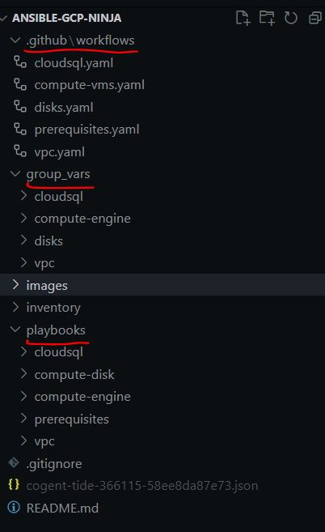
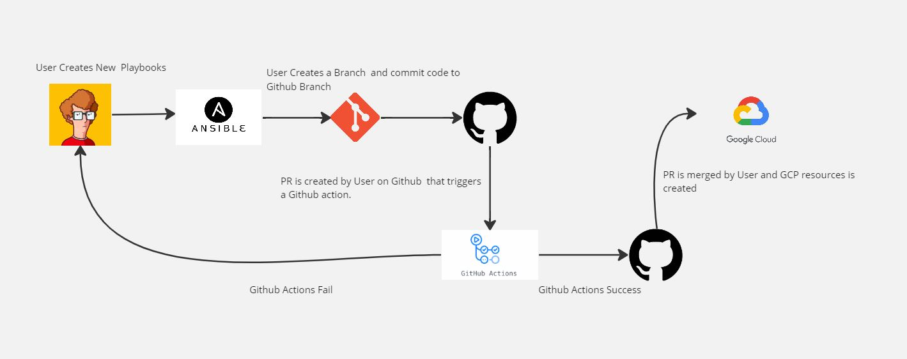
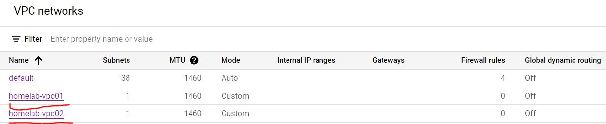
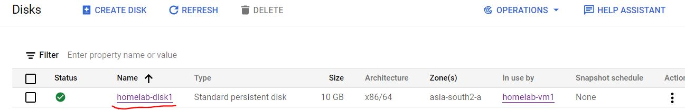
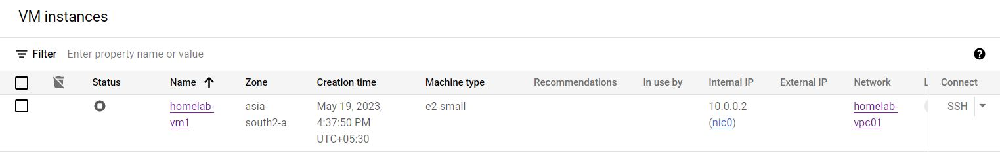
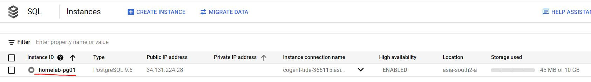

# OVERVIEW

This repository is a POC for deploying GCP resources using Ansible Google Cloud Collections named : google.cloud .

It list down some Observations/Challenges with regards to using IAC using Ansible.

This collection is not a part of ansible-core and needs to be install seperately using command :

ansible-galaxy collection install google.cloud

To perform installtion of collection we have a Ansible Playbook and a github action Workflow as shown in below image:

## GITHUB REPO Structure :

As per above image this repo makes use of Ansible group_vars concept and the structure is divided as follows:

1. Github Workflows: Each GCP resource creation has a github action workflow Job.
2. Repo is using a Self hosted Github Runner on Control Plane VM
3. Each GCP resource being made has there own vars.yaml file under group_vars/resource directory.
4. playbooks directory contains ansible playbooks for creation of each resource.

## High level Flow Diagram :

## GCP Resources being created: 
#### VPC:

#### Disk:

#### Disk:

#### GCE-VM:

#### CloudSQL(Postgres):

### Observations of Using Ansible as IAC:

1. Ansible is a configuration management tool.
2. It is mainly used for configuring servers with the right software and updating already configured resources.
3. It Lacks lifecycle management for Cloud Resources compared to other IAC tools like terraform as there is no state    Management Concept for IAC using Ansible meaning it makes CRUD of Cloud resources complex.
